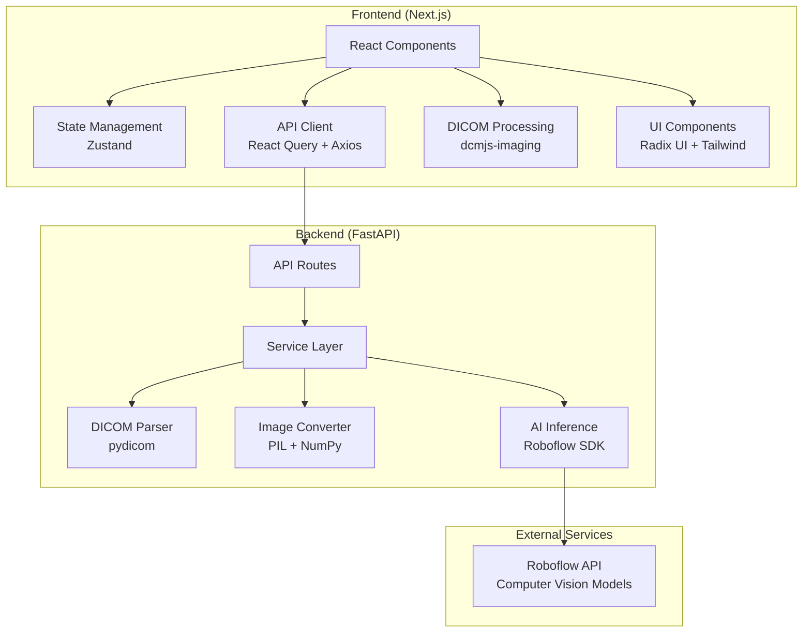

<div align="center">
  
</div>
<h1 align="center">
Dental X-Ray Analysis AI
</h1>
<p align="center">


</p>

_An AI-powered platform for detecting dental conditions in X-ray images using computer vision and DICOM processing_

[Features](#-features) • [Architecture](#-architecture) • [Setup](#-setup--installation) • [API Documentation](#api-documentation)

---

## 📋 Table of Contents

- [🌟 Introduction](#-introduction)
- [✨ Features](#-features)
- [🏗️ Architecture](#️-architecture)
- [🛠️ Tech Stack](#️-tech-stack)
- [📋 Prerequisites](#-prerequisites)
- [🚀 Setup & Installation](#-setup--installation)
- [🏃‍♂️ Running the Application](#️-running-the-application)
- [📚 API Documentation](#-api-documentation)
- [🐳 Docker Deployment](#-docker-deployment)
- [📁 Project Structure](#-project-structure)
- [⚙️ Environment Configuration](#️-environment-configuration)
- [🔧 Development](#-development)

## 🌟 Introduction

Dobbe is a modern web application that leverages artificial intelligence to analyze dental X-ray images and detect various dental conditions such as cavities and periapical lesions. The platform supports both standard image formats and DICOM files, providing comprehensive metadata extraction and analysis capabilities.

## ✨ Features

### 🔍 AI-Powered Detection

- **Cavity Detection**: Automatically identify cavities with confidence scores
- **Periapical Lesion Detection**: Detect periapical lesions with precise bounding boxes
- **Real-time Analysis**: Fast inference using Roboflow's computer vision models

### 📁 File Support

- **DICOM Processing**: Full DICOM file support with metadata extraction
- **Drag & Drop Interface**: Intuitive file upload experience
- **File Validation**: Comprehensive file type and size validation (max 10MB)

### 📊 Comprehensive Results

- **Visual Overlays**: Bounding boxes with detection confidence
- **Metadata Display**: Complete DICOM metadata presentation
- **Export Capabilities**: Download results and reports

## 🏗️ Architecture



### Architecture Highlights

- **Microservices Design**: Separate frontend and backend services
- **Type Safety**: Full TypeScript implementation with Pydantic models
- **Async Processing**: Non-blocking file processing and API calls
- **Error Handling**: Comprehensive error boundaries and validation
- **Scalable Structure**: Modular design for easy feature additions

## 🛠️ Tech Stack

### Frontend

- **Framework**: Next.js 15.3.3 with React 19
- **Language**: TypeScript
- **Styling**: Tailwind CSS v4 with customized shadcn/ui
- **State Management**: Zustand + React Query (TanStack Query)
- **UI Components**: shadcn/ui + Radix UI primitives
- **Medical Imaging**: dcmjs-imaging for DICOM preview (uses WASM for fast client side parsing)
- **File Handling**: React Dropzone

### Backend

- **Framework**: FastAPI with Python 3.12+
- **Medical Imaging**: pydicom for DICOM processing
- **Image Processing**: Pillow (PIL) + NumPy
- **AI Inference**: Roboflow Inference SDK
- **Validation**: Pydantic v2 with type safety
- **Configuration**: Pydantic Settings with environment variables
- **Package Management**: UV for fast dependency resolution

### External Services

- **AI Models**: [Roboflow computer vision platform](https://app.roboflow.com/ "Roboflow computer vision platform")
- **Model**: [Custom dental detection model (adr/6)](https://universe.roboflow.com/new-workspace-oorwh/adr/model/6 "Custom dental detection model (adr/6)")

## 📋 Prerequisites

- **Node.js**: v18.0.0 or higher
- **Python**: 3.12 or higher
- **UV**: Python package manager ([installation guide](https://docs.astral.sh/uv/getting-started/installation/))
- **pnpm**: Fast package manager for Node.js (optional but recommended)
- **Roboflow API Key**: Required for AI inference

## 🚀 Setup & Installation

### 1. Clone the Repository

```bash
git clone https://github.com/adityanandanx/dental-conditions-detection
cd dental-conditions-detection
```

### 2. Backend Setup

```bash
cd backend

# Install dependencies using UV
uv sync

# Create environment file
cp .env.example .env
# Edit .env and add your Roboflow API key
```

### 3. Frontend Setup

```bash
cd ../frontend

# Install dependencies
pnpm install
# or
npm install

# Create environment file
cp .env.example .env.local
```

### 4. Environment Configuration

Create `.env` files in both directories:

**Backend (`backend/.env`)**:

```env
ROBOFLOW_API_KEY=your_roboflow_api_key_here
DEBUG=false
```

**Frontend (`frontend/.env.local`)**:

```env
NEXT_PUBLIC_API_URL=http://localhost:8000/api/v1
```

## 🏃‍♂️ Running the Application

### Development Mode

**Terminal 1 - Backend**:

```bash
cd backend

# Unix/Linux/macOS
source .venv/bin/activate
# Windows
.venv\Scripts\activate

fastapi dev
```

**Terminal 2 - Frontend**:

```bash
cd frontend
pnpm dev
# or
npm run dev
```

### Production Mode

**Backend**:

```bash
cd backend

# Unix/Linux/macOS
source .venv/bin/activate
# Windows
.venv\Scripts\activate

fastapi run
```

**Frontend**:

```bash
cd frontend
pnpm build && pnpm start
# or
npm run build && npm start
```

### Access Points

- **Frontend**: http://localhost:3000
- **Backend API**: http://localhost:8000
- **API Documentation**: http://localhost:8000/docs
- **Alternative API Docs**: http://localhost:8000/redoc

## 📚 API Documentation

### Endpoints

#### `POST /api/v1/detect`

Detect dental conditions in standard image files.

**Request**: Multipart form with image file
**Response**: Detection results with bounding boxes and confidence scores

#### `POST /api/v1/detect-dicom`

Process DICOM files with metadata extraction and condition detection.

**Request**: Multipart form with DICOM file
**Response**: Complete analysis with the following format:

```json
{
  "predictions": [
    {
      "x": 346.5,
      "y": 323.5,
      "width": 107,
      "height": 105,
      "confidence": 0.839,
      "class": "cavity",
      "class_id": 0,
      "detection_id": "uuid-string"
    }
  ],
  "metadata": {
    "patient_id": "12345",
    "study_date": "20241208"
    // ... additional DICOM metadata
  },
  "image_info": {
    "original_shape": [512, 512],
    "converted_format": "JPEG",
    "converted_size": [512, 512]
  }
}
```

#### `GET /api/v1/health`

Health check endpoint for monitoring.

## 🐳 Docker Deployment

### Quick Start

```bash
# Copy environment file and add your Roboflow API key
echo "ROBOFLOW_API_KEY=your_api_key_here" > .env

# Start production environment
make quick-start
# or
docker compose build && docker compose up -d
```

**Access**: Frontend at http://localhost:3000, Backend at http://localhost:8000

### Development with Docker

```bash
# Copy environment file and add your Roboflow API key
echo "ROBOFLOW_API_KEY=your_api_key_here" > .env

# Start development with hot reload and file watching
make dev
# or
docker compose build && docker compose -f docker-compose.dev.yml up --build

# Or use Docker Compose watch (requires v2.22+)
make watch
# or
docker compose -f docker-compose.dev.yml watch
```

### Architecture Features

- **Multi-stage builds**: Optimized images with builder and production stages
- **Health checks**: Built-in health monitoring for both services
- **Volume caching**: Persistent volumes for dependencies and build cache
- **Security**: Non-root users in production containers
- **Development workflow**: File watching with automatic rebuilds

### Available Commands

```bash
make help           # Show all available commands
make dev           # Development with hot reload
make up            # Production deployment
make logs          # View service logs
make health        # Check service health
make clean         # Clean up containers and volumes
```

### Container Specifications

- **Backend**: Python 3.12-slim with medical imaging libraries (pydicom, OpenCV) utilizing uv package manager
- **Frontend**: Node.js 20-slim with pnpm package manager
- **Volumes**: Cached dependencies and build artifacts for faster rebuilds
- **Networking**: Internal service communication with external port exposure

## 📁 Project Structure

```
dobbe/
├── frontend/                   # Next.js frontend application
│   ├── src/
│   │   ├── app/               # App Router pages
│   │   ├── components/        # React components
│   │   │   ├── ui/           # Base UI components
│   │   │   ├── dicom/        # DICOM-specific components
│   │   │   ├── detection/    # Detection result components
│   │   │   └── results/      # Results display components
│   │   ├── hooks/            # Custom React hooks
│   │   └── lib/              # Utilities and configurations
│   ├── public/               # Static assets
│   ├── Dockerfile            # Frontend Docker configuration
│   ├── package.json          # Node.js dependencies
│   ├── pnpm-lock.yaml        # pnpm lock file
│   ├── next.config.ts        # Next.js configuration
│   ├── tsconfig.json         # TypeScript configuration
│   ├── eslint.config.mjs     # ESLint configuration
│   ├── postcss.config.mjs    # PostCSS configuration
│   ├── components.json       # shadcn/ui configuration
│   └── .env.example          # Environment variables template
│
├── backend/                   # FastAPI backend application
│   ├── app/
│   │   ├── api/              # API route handlers
│   │   ├── core/             # Core configurations
│   │   ├── models/           # Pydantic data models
│   │   ├── services/         # Business logic services
│   │   └── dependencies/     # Shared dependencies
│   ├── Dockerfile            # Backend Docker configuration
│   ├── pyproject.toml        # Python dependencies and project config
│   ├── uv.lock              # UV lock file
│   └── .env.example          # Environment variables template
│
├── docker-compose.yml        # Production Docker Compose
├── docker-compose.dev.yml    # Development Docker Compose
├── Makefile                  # Build and development commands
├── logo.svg                  # Project logo
├── README.md                 # Project documentation
├── .env.example              # Global environment variables template
└── .gitignore               # Git ignore patterns
```

## ⚙️ Environment Configuration

### Required Environment Variables

| Variable              | Description                    | Required | Default                        |
| --------------------- | ------------------------------ | -------- | ------------------------------ |
| `ROBOFLOW_API_KEY`    | API key for Roboflow inference | Yes      | -                              |
| `DEBUG`               | Enable debug mode              | No       | `false`                        |
| `NEXT_PUBLIC_API_URL` | Backend API URL                | No       | `http://localhost:8000/api/v1` |

## 🔧 Development

### Code Quality

The project includes comprehensive tooling for code quality:

- **TypeScript**: Strict type checking
- **ESLint**: Code linting with Next.js configuration
- **Pydantic**: Runtime type validation for Python
- **UV**: Fast and reliable Python package management

### Testing

```bash
# Frontend
cd frontend
pnpm test

# Backend
cd backend
uv run pytest
```

<p align="center">
  <b>Built with ❤️ for advancing dental healthcare through AI</b>
  <br/>
  <a href="#-table-of-contents">
  ⬆ Back to top
  </a>
</p>

<br/>

<br/>

<br/>
